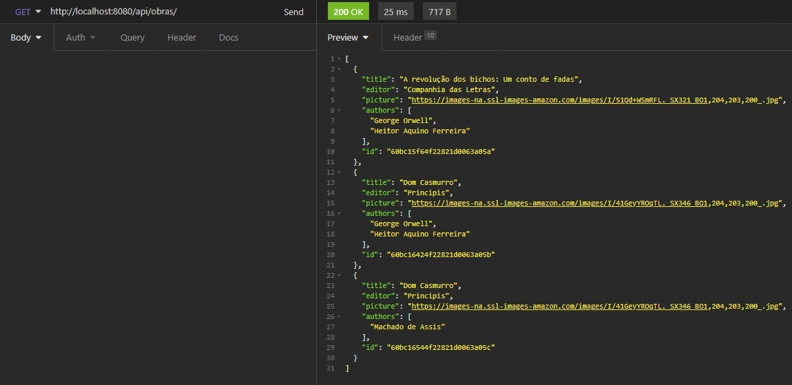
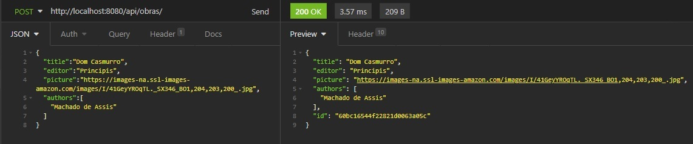
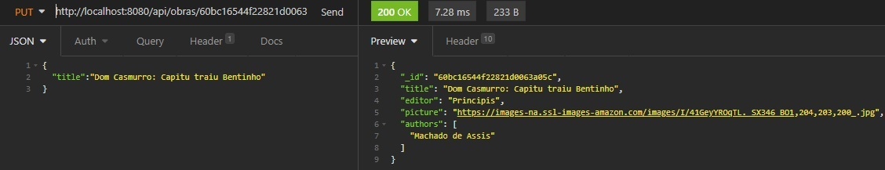
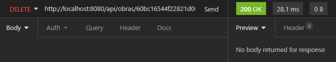

<br />
<p align="center">
    
 <br />
  <p align="center">
     Sistema de gerenciamento de biblioteca
       <br />
    <br />
    <a href="https://github.com/devchallenge-io/biblioteca-backend">Desafio</a>
    ·
    <a href="https://www.devchallenge.com.br/">DevChallenge</a>
  </p>
</p>

## Índice

* [Desafio](#desafio)
* [Techs](#techs)
* [Screens](#screens)
* [Como rodar](#como-rodar)
* [Compartilhe](#compartilhe)


# Desafio
O desafio é criar o backend para um sistema de gerenciamento de uma biblioteca!

## Requisitos/Rotas:

<b>[POST]</b> /obras :  A rota deverá receber titulo, editora, foto, e autores dentro do corpo da requisição. Ao cadastrar um novo projeto, ele deverá ser armazenado dentro de um objeto no seguinte formato: 
```js
{ id: 1, titulo: 'Harry Potter', editora: 'Rocco',foto: 'https://i.imgur.com/UH3IPXw.jpg', autores: ["JK Rowling", "..."]};
```
<b>[GET]</b> /obras/ : A rota deverá listar todas as obras cadastradas<br><br>
<b>[PUT]</b> /obras/:id: : A rota deverá atualizar as informações de titulo, editora, foto e autores da obra com o id presente nos parâmetros da rota<br><br>
<b>[DELETE] </b> /obras/:id: : A rota deverá deletar a obra com o id presente nos parâmetros da rota<br>


# Tech: 

  - Node
  - TypeScript
  - Express para a API
  - Commander e Inquirer para o CLI
  - Modulo readline do node para console

# Screens
<details><summary>GET</summary>



</details>
<details><summary>POST</summary>



</details>
<details><summary>PUT</summary>



</details>
<details><summary>DELETE</summary>



</details>

# Como rodar:
0 - Clone o repo
``` 
$ git clone https://github.com/Rawallon/biblioteca-backend.git & cd biblioteca-backend
```

1 - Instale as dependencias
```
$ npm install
```

2.1 - Rodar como API 
```
$ npm start
```

2.2 - Rodar como interface
```
$ npm run cli
```
